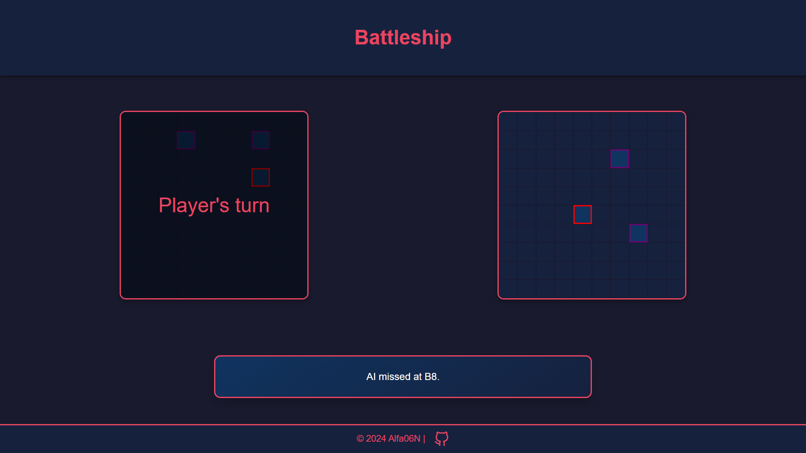

# Battleship Game

A classic **Battleship** game implemented as a web-based application, where players can compete against an AI opponent. The project is a recreation of the traditional pen-and-paper game, designed with dynamic and interactive gameplay.

---

## **Description**

This project brings the timeless Battleship game to the browser. Players take turns attacking the opponent's ships on a grid-based game board. The goal is to sink all of the opponent's ships by guessing their hidden positions. The game features smooth gameplay, a responsive interface, but simple AI opponents for now.

---

## **Principal Features**

### **Gameplay**

- **Turn-based Mechanics**: Players alternate turns to attack the opponent's board.
- **Ship Placement**: Ships are placed randomly on the board, ensuring variety in every game.

### **Feedback and Visuals**

- **Dynamic Console Logging**: Logs game events such as hits, misses, and when ships are sunk.
- **Color-coded Feedback**: Visual indicators differentiate hits, misses, and sunken ships.

### **Game State Management**

- **Restart Functionality**: Players can reset the game and start fresh.
- **Game Over Detection**: Automatically identifies and announces the winner when all ships are sunk.

---

## **How to Play**

1. **Start the Game**: The player and AI opponent begin with randomly placed ships.
2. **Take Turns**: Click on the opponent’s grid to attack.
   - A _hit_ is logged when an attack strikes a ship.
   - A _miss_ occurs when the attacked cell is empty.
   - Ships are sunk when all their cells are hit.
3. **End Game**: The game ends when all of one side's ships are sunk.
4. **Restart**: Use the restart functionality to play again.

---

## **Technologies Used**

- **HTML/CSS/JavaScript**: Core web development technologies for structure, styling, and interactivity.
- **Custom Event Handling**: For managing gameplay interactions efficiently.
- **Modular Design**: Organized code with classes and methods for better readability and maintainability.

---

## **Screenshot**



---

## **Future Enhancements**

- **Multiplayer Mode**: Allowing two players to compete against each other.
- **Custom Grid Sizes**: Adjustable board dimensions and ship configurations.
- **Improve AI attacks**: Creating a greater challenge for players.
- **Player Statistics**: Tracking wins, losses, and average moves.
- **Sound Effects and Animations**: Enhancing visual and audio feedback.

---

## **How to Run the Project**

1. Clone the repository:
   ```bash
   git clone https://github.com/Alfa06N/Repositorio.git
   ```
2. Navigate to the project directory and launch the `index.html` file contained in the dist folder in a web browser.
3. Start playing and enjoy!

---

## **Contributing**

Contributions are welcome! Feel free to fork the repository and submit pull requests with improvements, bug fixes, or new features.

---

## **License**

This project is licensed under the MIT License. Feel free to use, modify, and distribute it as you see fit.

---

Enjoy your game of Battleship!
