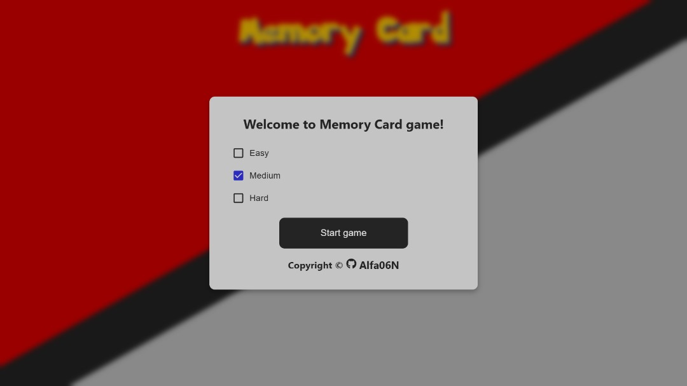
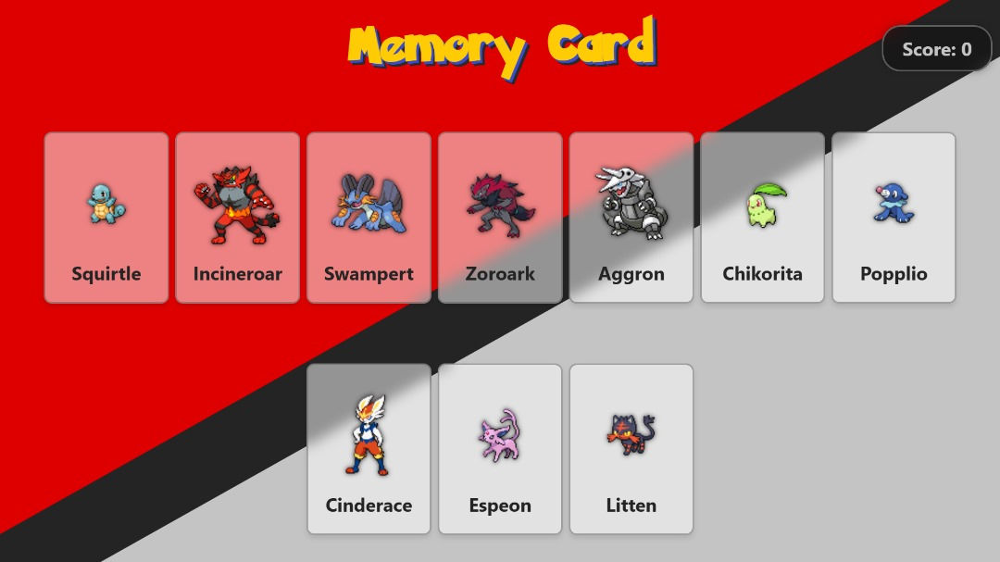
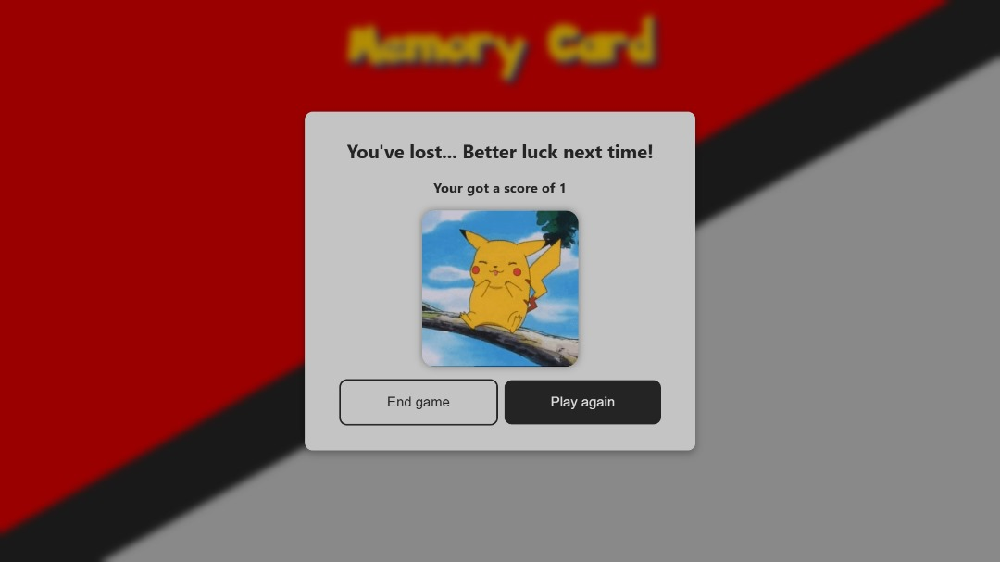

# Memory Card Game

A fun and challenging memory game where players must select each card only once without repeating. The game uses Pokémon images fetched from the [PokeAPI](https://pokeapi.co/), making it a delightful experience for Pokémon fans. Test your memory and see if you can conquer the game by avoiding repeated selections!

## Features

- **Responsive Design:** The game is fully responsive and works seamlessly on different screen sizes.
- **Customizable Difficulty Levels:** Choose between Easy, Medium, and Hard modes, which vary the number of cards to match (5, 10, or 15 cards).
- **Pokémon Cards:** The game fetches Pokémon images from the [PokeAPI](https://pokeapi.co/) to populate the memory cards.
- **Game Flow:** If the player wins or loses, a dialog is shown to offer a choice to either play again or end the game, bringing the player back to the difficulty selection screen.

## Technologies Used

- **React**: The game is built using React for efficient state management and rendering.
- **CSS & HTML**: Custom styles and responsive layouts for a polished user experience.
- **PokeAPI**: Fetches random Pokémon images to populate the memory cards.
- **Giphy**: You get Pikachu gifs to display at the end of the game for a more fun experience.

## How to Play

1. Choose a difficulty level:
   - **Easy:** 6 cards to match.
   - **Medium:** 12 cards to match.
   - **Hard:** 18 cards to match.
2. Your goal is to select each card **only once** without repeating.
3. If you select a card you’ve already chosen, the game ends.
4. Successfully select all cards without repetition to win the game!
5. At the end, a dialog appears to let you play again or return to the difficulty selection screen.

## Installation

To run the game locally, follow these steps:

1. **Clone the repository**:

   ```bash
   git clone https://github.com/Alfa06N/Repositorio.git
   cd Memory-Card
   ```

2. **Install dependencies**:

   ```bash
   npm install
   ```

3. **Start the development server**:

   ```bash
   npm run dev
   ```

## Screenshots


_Screenshot of the start of the game._


_Screenshot of the gameplay._



## License

This project is licensed under the [MIT License](./LICENSE).

Thank you for visiting my Memory-Card repository! If you like this project, don't forget to star the repository and share it with others!
